In this guide, I will be showing you how to make and run a [Garry's Mod](https://store.steampowered.com/app/4000/Garrys_Mod/) server with **mods** (addons) on both [Windows](https://www.microsoft.com/en-us/windows?r=1) and Linux!

Garry's Mod is a popular sandbox game that thrives off of mods and user-created content, offering a vast library of mods to enhance gameplay. These mods, available on platforms like the [Steam Workshop](https://steamcommunity.com/app/4000/workshop/) and [GitHub](https://github.com/topics/gmod), add unique twists to the gameplay experience, from new maps and tools to entirely custom game modes.

Running a server with mods allows players to connect and enjoy a shared, customized experience using the addons the server has installed.

The two operating systems we'll be targeting specifically in this guide are **Windows 11** and [**Debian 12**](https://www.debian.org/download) (Linux).

I wanted to note a couple of things before continuing in this guide.
* The terms *addon* and *mod* are used interchangeably to refer to user-created content or modifications in Garry's Mod. In Garry's Mod, custom content is referred as *addons*.
* Similarly, the terms `directory` (known in Linux) and `folder` (known in Windows) are used interchangeably.

## Table Of Contents

## Requirements
### Server Specs & Network Connection
Garry's Mod servers are fairly light on RAM usage compared to servers in other games such as [Minecraft](https://www.minecraft.net/) and [Rust](https://store.steampowered.com/app/252490/Rust/). However, the amount of processing power required depends on various factors. If you don't plan on having many players on the server concurrently (all at once) or don't plan on opening the server to the public, you can usually get away with running the server on an older CPU depending on what mods you run.

With that said, the speed of your network plays a part in how many players you can have on the server concurrently. Especially how much bandwidth you're able to send to players (upload speed).

A few factors to consider are:

1. The amount of players who will be playing on the server concurrently.
1. The amount of additional network data mods on your server generate.
3. Performance and rate settings (explained later on in this guide).

If you're opening your server to public, I also recommend having your server hosted through a dedicated server provider. Other than the fees typically associated with server hosting, having your server hosted in a data center beats having it hosted at home due to more stability, better network speeds and routing (latency), better protection from [(D)DoS attacks](https://www.cloudflare.com/learning/ddos/what-is-a-ddos-attack/), and more.

I'd recommend looking around and performing research for the best game server hosting solution suitable for you. There are many options, but the server's location, price, performance, and (D)DoS protection are important factors to consider if you plan on having the server publicly available.

### Port Forwarding
If you plan on having your server accessible from the Internet, you may need to port forward both UDP and TCP ports `27015` through your router. This guide will not cover port forwarding specifically. However, I did want to provide other helpful guides on how to port forward the ports I've just mentioned.

* [NordVPN - How to open ports on your router](https://nordvpn.com/blog/open-ports-on-router/)
* [No-IP - How to Port Forward – General Guide to Multiple Router Brands](https://www.noip.com/support/knowledgebase/general-port-forwarding-guide)
* [PortForward - How To Forward a Port](https://portforward.com/)

If your LAN network is operating as a [NAT](https://www.comptia.org/content/guides/what-is-network-address-translation) network, you may need to create a NAT rule as well.

## Downloading & Running SteamCMD
The first step to making a Garry's Mod server is downloading and running [SteamCMD](https://developer.valvesoftware.com/wiki/SteamCMD).

SteamCMD is a [CLI tool](https://aws.amazon.com/what-is/cli/) for [Steam](https://store.steampowered.com/) that allows you to download both client and server files.

### Windows
Instructions on downloading and extracting SteamCMD on Windows may be found [here](https://developer.valvesoftware.com/wiki/SteamCMD#Windows).

1. Download the `steamcmd.zip` file from [here](https://steamcdn-a.akamaihd.net/client/installer/steamcmd.zip).
1. Create a folder where you can store and extract the contents from the `steamcmd.zip` file. In this guide, we'll be using `E:\servers\steamcmd`.
1. Use Window's ZIP tool to extract the contents of `steamcmd.zip` into the newly created folder. Alternatively, you may use a tool such as [7-Zip](https://www.7-zip.org/).

You should now see a `steamcmd.exe` executable file that you can run to complete the next steps.


### Linux
Instructions on downloading and extracting SteamCMD on Linux may be found [here](https://developer.valvesoftware.com/wiki/SteamCMD#Linux). I prefer manually downloading and extracting SteamCMD which is what I will be doing in this guide.

You will need to download a few packages that are required to download, run, and extract SteamCMD and run Source Engine servers.

#### Debian/Ubuntu-Based (Apt)
```bash
sudo apt install -y lib32gcc-s1 lib32stdc++6 curl tar
```

**NOTE** - If you do not have `sudo` installed, you will need to login as root via the `su -` command and execute commands throughout this guide without using `sudo` at the beginning.


While it isn't necessarily *required*, it is also recommended you create a separate user to run SteamCMD and your Garry's Mod server. You may use the following commands on Debian/Ubuntu-based systems to create a new user.

```bash
# Create servers group.
sudo groupadd servers

# Create servers user with home directory set to /home/servers and using /bin/bash as the shell.
sudo useradd -m -d /home/servers -g servers -s /bin/bash servers

# Login as servers.
sudo su servers -
```


Next, you'll want to create a directory to store the contents from the `steamcmd_linux.tar.gz` file.

```
# Create a 'steamcmd/' directory inside the user's home directory.
mkdir ~/steamcmd

# Change directories to the created directory from above.
# Tip - You can also use 'cd $_' if you've just created the new directory.
cd ~/steamcmd
```


Now, you'll want to download the [`steamcmd_linux.tar.gz`](https://steamcdn-a.akamaihd.net/client/installer/steamcmd_linux.tar.gz) file and extract it. I recommend using the `curl` or `wget` commands to download the file and `tar` to extract it. In this guide, we'll be using a one-liner that utilizes `curl` and `tar`.

```bash
curl -sqL "https://steamcdn-a.akamaihd.net/client/installer/steamcmd_linux.tar.gz" | tar zxvf -
```

If the command above was successful, you should see a new `steamcmd.sh` file when listing files in the new directory using a command such as `ls -l`.


You can now run the new `steamcmd.sh` program using the following command which'll also update the SteamCMD installation.

```bash
./steamcmd.sh
```


## Downloading The Server Files
Once you've launched SteamCMD, the first thing you'll need to do is set the directory where to install the Garry's Mod server files to via the `force_install_dir` command. In this guide, we will be installing the server inside of a directory called `gmod/` within whatever directory or folder we create for SteamCMD. Therefore, we'll be setting `force_install_dir` to `/home/servers/gmod` on Linux (or `E:\servers\gmod` on Windows).

### Windows
```bash
force_install_dir E:\servers\gmod
```

### Linux
```bash
force_install_dir /home/servers/gmod
```

Afterwards, you'll want to log into Steam using the `login <username>` command. Most dedicated server apps/tools allow a user to sign in *anonymously* through SteamCMD including Garry's Mod, so you **won't** need to input your Steam username or password in this case!

```bash
login anonymous
```

Next, you'll want to retrieve the app ID you'll like to install from [this list](https://developer.valvesoftware.com/wiki/Dedicated_Servers_List). In our case, Garry's Mod server's app ID is `4020`.

Now, you'll want to use the `app_update <app ID>` command to download or update the Garry's Mod server files. Additionally, you may add `validate` to the end of the command if you want to verify the server files to ensure the files aren't corrupt. Keep in mind, passing `validate` to end of the command will make downloading take longer to finish.

Install or update Garry's Mod server files without validating (faster, but doesn't check for corrupt files).

```bash
app_update 4020
```
Install or update Garry's Mod server files along with validating (slower, but ensures server files aren't corrupt).

```
app_update 4020 validate
```

It will take some time to download the server files depending on your network and disk speeds. After you're done, you may navigate to the directory you've installed the server into.

## Running The Garry's Mod Server
To save time, we're going to create scripts to start the Garry's Mod server.

### Windows
When looking at the new server files through the File Explorer, you should see a file named `srcds.exe`.

We will be creating a [Batch](https://en.wikipedia.org/wiki/Batch_file) file/script named `start-server.bat` to run the server. Before creating this file, you will need to ensure you can set the file's extension by ensuring you're able to view extensions in file names. If you can't view file extensions, read here.

After creating the Batch file, add the following contents.

```batch
@echo off
.\srcds.exe -game garrysmod -console -ip 0.0.0.0 -port 27015 +maxplayers 32 +map gm_construct
```

### Linux
After navigating to the server file's directory by executing `cd ~/gmod` or similar, you should see `srcds_run` and `srcds_linux` files inside of the directory. We will be creating a simple Bash script to start the server.

There are many different types of text editors you use to create the script such as [Nano](https://www.nano-editor.org/) and [Vim](https://www.vim.org/), in this tutorial we will be using Nano. We will name the script `start-server.sh`.

Firstly, use the following command to start editing the new file.

```bash
nano start-server.sh
```

Next, paste the following contents into the file.

```bash
#!/bin/bash
./srcds_run -game garrysmod -console -ip 0.0.0.0 -port 27015 +maxplayers 32 +map gm_construct
```

The above command launches a Garry's Mod sandbox server on the map `gm_construct` that is bound to any IP address and interface on the server via `0.0.0.0` along with bound to port `27015` (the default port for SRCDS servers).

After you're finished, hit `CTRL` + `X` and enter to save the file. If you would like to see the contents of the file, you may execute `cat start-server.sh`.

Once you've saved the file, you will also want to give the user permission to execute the file which may be done with the command below.

```bash
chmod u+x start-server.sh
```

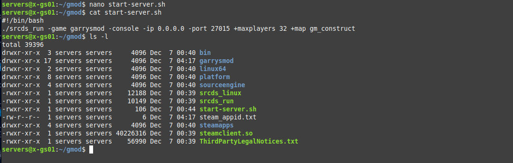

Finally, you can start the server using the following command.

```bash
./start-server.sh
```

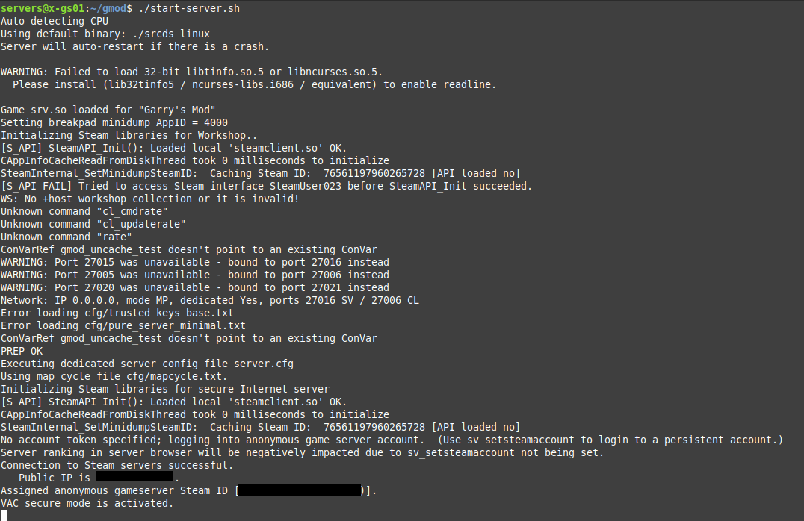

**NOTE** - You should see a `VAC secure mode is activated` message unless if you've specifically disabled VAC. With that said, if you want the server accessible from the Internet, you should also see a `Public IP is <your WAN IP>` message which is stripped out of the screenshot above.

To stop the server, you can execute the `quit` command through the server console or hit `CTRL` + `C` which sends a signal to terminate the server's process.

#### Using Screen
Once installed, you may also use the `screen` command to allow the server to run without needing to keep the Linux terminal open (in the background). I'd recommend reading up on the `screen` command [here](https://www.geeksforgeeks.org/screen-command-in-linux-with-examples/).

First, let's install the screen package. You may need to log out of the current `servers` user via the `exit` command since the command must be ran as root or via `sudo`.

##### Debian/Ubuntu
```bash
sudo apt install -y screen
```

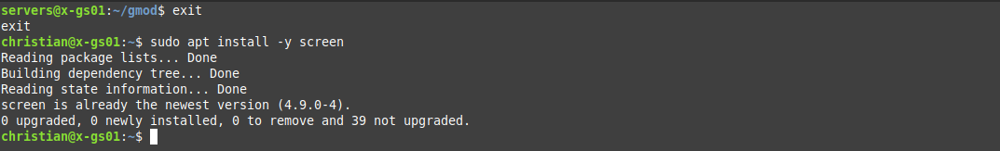

Next, copy the server startup command and add `screen -S <name>` in-front. Here is an example.

```bash
screen -S gmod ./srcds_run -game garrysmod -console -ip 0.0.0.0 -port 27015 +maxplayers 32 +map gm_construct
```

This will launch the server inside a screen. You can detatch from the screen using `CTRL` + `A` + `D` by default.

To attach the screen, you may run either `screen -r` (if there's only one screen open, it'll automatically attach to the single screen) or `screen -r <name>`. In the above command, we created a screen named `gmod`. Therefore, we can use the following command to attach to the screen by name.

```bash
screen -r gmod
```

You may also change the server's startup script and prepend `screen -S <name>` similar to the above to have the script automatically launch the server into a screen.

## Creating A Server Config File
The next step is to configure the server by modifying the `server.cfg` file. This file is located in the `garrysmod/cfg` directory on Linux or the `garrysmod\cfg` folder on Windows.

The configuration format Garry's Mod uses inside of the `server.cfg` file is `<ConVar> "<Value>"`. We will be setting basic things like the server's hostname and password.

Paste the following contents into the `server.cfg` file and modify the ConVar's values to your needs.

```bash
hostname "My Server Name"
sv_password ""
rcon_password "CHANGEME"
```

* The `hostname` is the name of the server seen through the server browser or on external websites (anything that queries the server through [A2S](https://developer.valvesoftware.com/wiki/Server_queries) queries).
* The `sv_password` is the password players must enter before joining the server. When left blank, no password prompt pops up when joining the server.
* The `rcon_password` is the password required for [RCON](https://developer.valvesoftware.com/wiki/Source_RCON_Protocol) access. This password should only be known by trusted individuals/staff since users with this password will be able to execute server commands assuming they're able to access the TCP port RCON is running on remotely.

There are also many other ConVars you may like inside of Garry's Mod that you can set through the `server.cfg` file! [Here's](https://wiki.facepunch.com/gmod/ConVars_In_Garrysmod) a good list of ConVars in Garry's Mod.

### Performance ConVars
There are quite a few ConVars you can set to help improve the server's performance depending on your network speeds, available bandwidth, and server specs.

If you're hosting your Garry's Mod server through a dedicated server provider, chances are you'll have good enough network speeds to max out the performance ConVars regardless of the amount of players that will be on your server concurrently (at once). However, I'd recommend ensuring you have at least **100 mbps** upload speed.

You may also check your network speeds at a website such as [SpeedTest.net](https://speedtest.net). I personally like [CloudFlare's](https://cloudflare.com/) speed test which may be found [here](https://speed.cloudflare.com/)!

If you don't have fast network speeds, I'd recommend using a calculator like [this](https://ambaca.github.io/rate-calculator-2015/) to calculate the values of ConVars that will help with your server.

Here is a list of performance ConVars that assumes your server has great download and upload network speeds along with a modern CPU.

```bash
sv_maxrate 0
sv_minrate 64000
sv_maxupdaterate 66
sv_minupdaterate 33
sv_maxcmdrate 66
sv_mincmdrate 33
net_splitpacket_maxrate 256000
net_maxcleartime 0.001
```

## Adding Mods (Addons)
There are two ways of installing mods and addons onto a Garry's Mod server.

The less modern way includes downloading the mod/addon files and extracting them into the server files directly (usually inside of the `addons/` and `lua` directories/). While this may give you more control over the mod/addon itself since you usually can modify the source code directly, it is less convenient and may require setting up a separate web server to allow players to download the mod/addon's client-side files (also known as a "[FastDL server](https://developer.valvesoftware.com/wiki/FastDL)").

The more modern solution that is considered more convenient is downloading mods through the [Steam Workshop](https://steamcommunity.com/app/4000/workshop/). 

In this guide, we will be focusing on downloading and installing mods onto the server through the Steam Workshop with a **collection**. A collection allows you to group mods. We can also set the server's collection ID via the `host_workshop_collection <collection ID>` command-line argument which will automatically download and install the mods/addons from the collection onto the server when the server starts up. With that said, we will also be creating a [Lua](https://nodecraft.com/support/games/gmod/glua-101-an-introduction-to-garrys-mod-coding) file that registers client-side mods/addons via the [`resource.AddWorkshop`](https://wiki.facepunch.com/gmod/resource.AddWorkshop) function which ensures when a player joins, they'll download the required client-side files for the addons (e.g. models, materials, sound files, etc.).

### Creating A Collection
The first thing we'll want to do is create a collection. You can do this within the Steam application itself or through Steam's website. We will be using the Steam application in this guide (they both generally have the same interface).

Firstly, navigate to **Community** -> **Workshop**.


Next, you'll want to type in **Garry's Mod** where it says "Search for a Workshop". You can click the item from the drop-down menu.

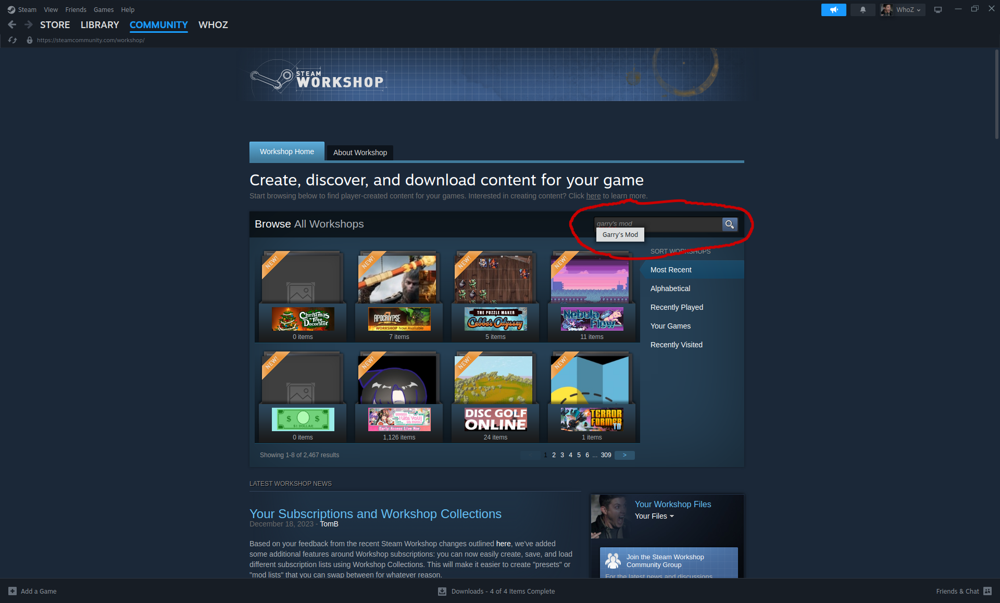

Now, click the **Browse** drop-down menu near the left-middle of the screen and click **Collections**.

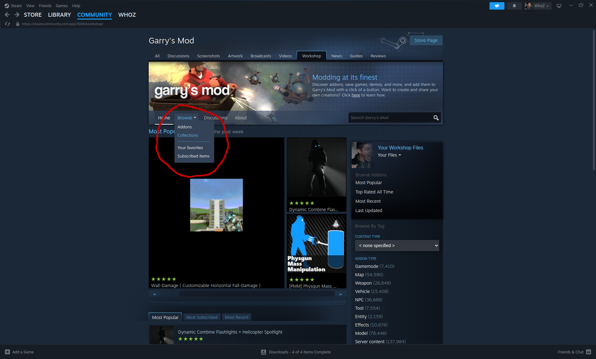

Afterwards, click the **Create Collection**.

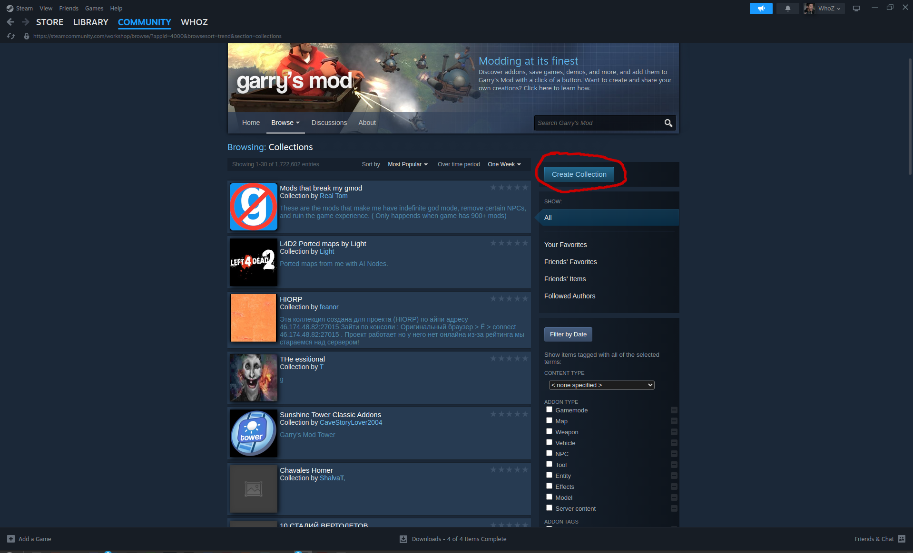

You'll want to then fill out all fields on the page. In this guide, the title will simply be "Test Collection".

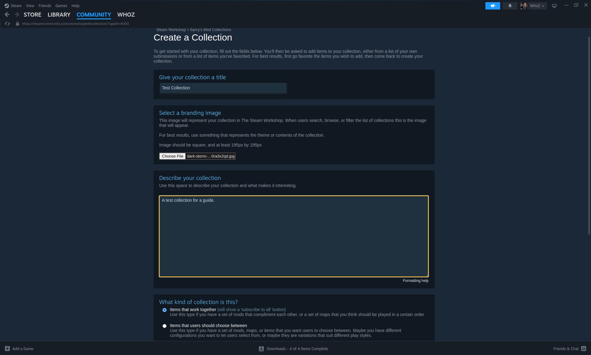

Finally, click the **Save and continue** button on the bottom-right to create the collection.

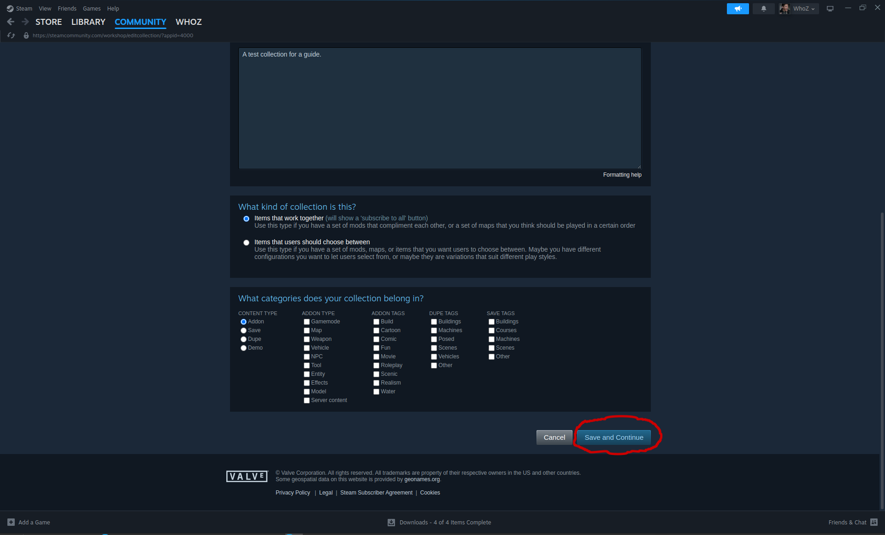

**NOTE** - If the collection is published and visible to others, users will be able to subscribe to all mods/addons from the collection with one click.

### Adding Mods/Addons To The Collection
The next step is to add mods/addons to your new collection and keep note of the IDs for later. You may browse workshop items for Garry's Mod using the steps mentioned above.

In this guide, I will be installing the [gDisasters](https://steamcommunity.com/sharedfiles/filedetails/?id=1431470677) mod/addon which is one of my favorite addons in Garry's Mod. This addon adds weather and nature events such as tornadoes, earth quakes, rain, snowstorms, and more! This single addon also requires a few other additional addons which contains materials and such.

After finding the item(s) you're interested in adding to the collection, open the item(s) by clicking their title links and click the **Add to Collection** button.

This will bring up a checkbox list of all collections you own. Ensure to check the collection you want the mod/addon added to and click **Ok**.

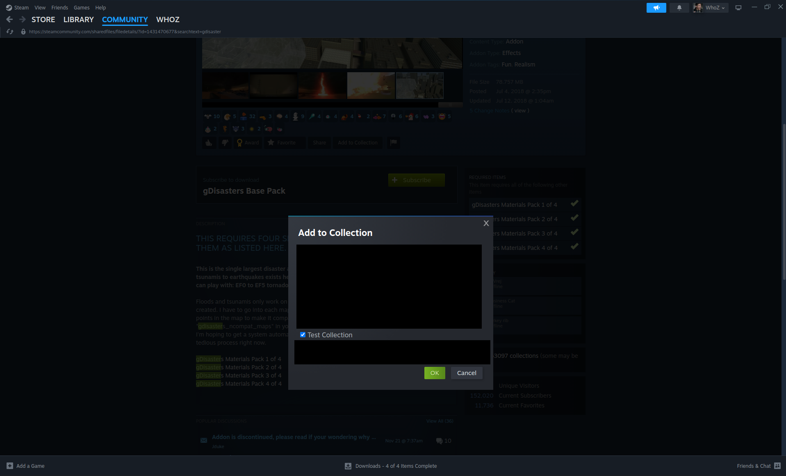

Next, we'll need to extract the ID from the URL. The numberic ID is located after the `id` query paramenter in the URL.

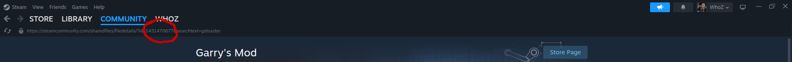

For example:

```
https://steamcommunity.com/sharedfiles/filedetails/?id=1431470677
```

The ID of the above addon is `1431470677`. Keep a note of the ID(s) you extract from the item(s) you add to the collection for later.

If you do not see a URL in the Steam application, read this under the F.A.Q.

### Automate Players Downloading Mod/Addon Client-Side Content
It is recommended you allow players that join your server to automatically download client-side files for the mod(s)/addon(s) you've added to your collection. To do this, we need to create a Lua script and use the [`resource.AddWorkshop("<id>")`](https://wiki.facepunch.com/gmod/resource.AddWorkshop) function.

For organization, we're going to technically create an addon on the file system.

Firstly, navigate to the `garrysmod/addons` directory on Linux (or `garrysmod\addons` folder on Windows) and create a new directory/folder named `cl-downloads`.

Next, create the directories/folders `lua/autorun/server` and navigate to it. Your current path should now look like `addons/cl-downloads/lua/autorun/server`.

Now, create a new Lua script. You can name the script whatever you'd like as long as you have the `.lua` file extension. In this guide, we'll be naming the file `addons.lua`.

Open the file for editing and paste the following line(s) depending on how many addons you have in your collection.

```lua
resource.AddWorkshop("collection ID")
```

Since in this guide we're using five addons, this is what the contents of the file looks like.

```lua
-- gDisasters Base Pack
resource.AddWorkshop("1431470677")

-- gDisasters Materials Pack 1 of 4
resource.AddWorkshop("1431447072")

-- gDisasters Materials Pack 2 of 4
resource.AddWorkshop("1431442150")

-- gDisasters Materials Pack 3 of 4
resource.AddWorkshop("1431435621")

-- gDisasters Materials Pack 4 of 4
resource.AddWorkshop("1431419203")
```

**NOTE** - The lines starting with `--` are referred as [comments](https://maurits.tv/data/garrysmod/wiki/wiki.garrysmod.com/index7193.html) which are ignored and also not required.

### Publishing The Collection
You will now need to publish the collection. Head back to the collection you've created and click the **Publish** button.

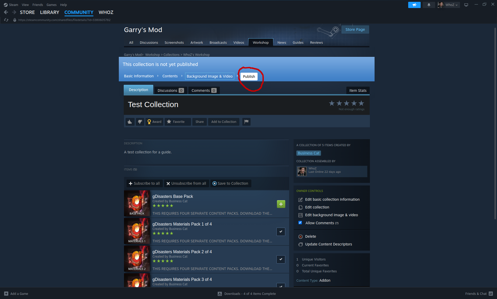

Next, you'll want to extract the ID of the collection by using a similar process to extracting the ID of a mod/addon. The numberic ID is located after the `id` query parameter in the URL when viewing your collection.

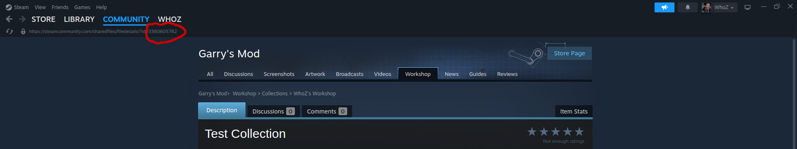

For example:

```
https://steamcommunity.com/sharedfiles/filedetails/?id=3380605782
```

The ID of the collection is `3380605782`.

### Link The Collection And Server
The next step is to link the collection and server using the collection ID we've retrieved above. We will be adding a command-line argument to the server's startup script we've created earlier.

Edit the server's startup script and append the following to the server's startup command.

```bash
+host_workshop_collection <collection ID>
```

For example, here are the new contents of the `startup-server.sh` file on Linux using the collection ID used in this guide:

```bash
#!/bin/bash
./srcds_run -game garrysmod -console -ip 0.0.0.0 -port 27015 +maxplayers 32 +map gm_construct +host_workshop_collection 3380605782
```

Afterwards, save the startup script and launch the server. Assuming the server is able to access Steam, it should automatically start downloading the mod(s)/addon(s) from the collection.

### Connect To The Server
Now let's connect to the server!

Firstly, you'll want to obtain the IPv4 address or hostname you need to connect to. If your server is hosted through a dedicated hosting provider, you should be able to find the IPv4 address/hostname required in multiple places including the following.

* Through your hosting provider's web panel.
* Using the public IP that is announced when starting the server.

**NOTE** - An IPv4 is in `xxx.xxx.xxx.xxx` format while a hostname is either a name or a domain (e.g. `myserver` or `myserver.mydomain.com`).

If you're on the server itself or the server is locally hosted, you can also obtain the IP of the server by listing your network interfaces + IPs using the `ip a` or `ifconfig` commands on Linux or `ipconfig /all` command on Windows (use Command Prompt or PowerShell).

After finding the IP, launch Garry's Mod and hit the `\` (or `~`) key on your keyboard to open the developer console.

When the developer console is shown, you will want to type `connect <ip/hostname>` or `connect <ip/hostname>:<port>`. Since we've bound the server to the default Garry's Mod port `27015`, we do not need to input a port in this case.

I'm going to use my server's internal hostname which is simply `x-gs01` under my home network.

```bash
connect x-gs01
```

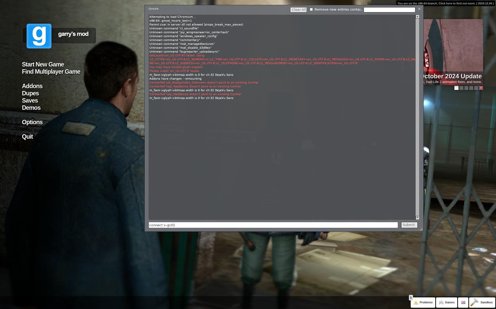

Once you start connecting, if your Garry's Mod client doesn't have the client-side files of the addons/mods you've added to your collection, it should download these files automatically as seen below.

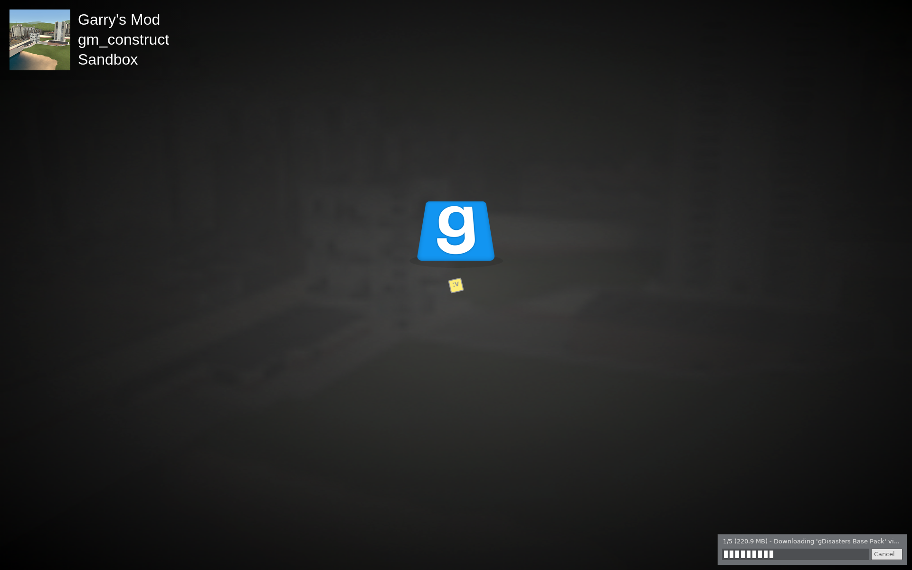

Once you've fully connected, the addons you've installed should be running on the server. In my case, gDisaster adds a tab to the menu where I can spawn natural disasters!

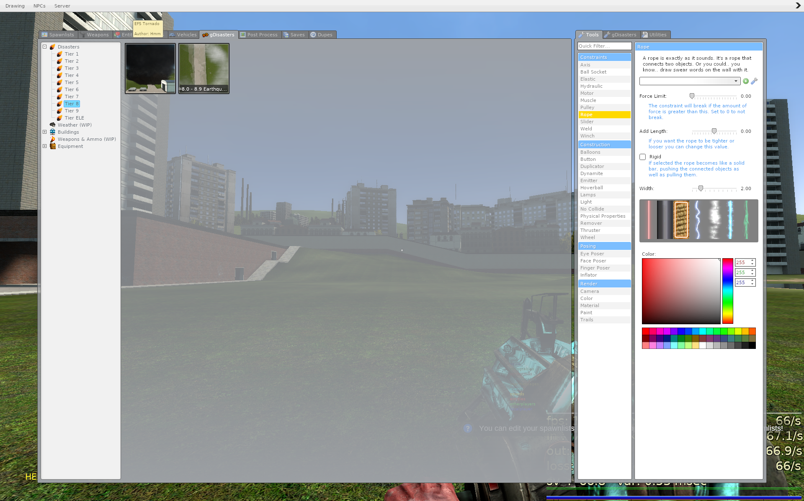

**NOTE** - To spawn items from mods/addons through the spawn menu, you may need to add yourself as an admin to the server. To do this, read here.

## Frequenty Asked Questions
### How do I add myself as an admin on the server?
Many people recommend installing separate mods/addons to handle admin and group functionality such as [ULX](https://github.com/TeamUlysses/ulx) and [ULib](https://github.com/TeamUlysses/ulib). However, there is also a way to set a user to admin without additional addons.

Firstly, find your Steam ID (or the Steam ID of the user you want to add as admin or superadmin). I recommend using an online tool such as [Steam ID Finder](https://www.steamidfinder.com/) or [Steam ID I/O](https://steamid.io/).

Next, modify the file `garrysmod/settings/users.txt` on Linux (or `garrysmod\settings\users.txt` on Windows). This file should already include content that acts as a template.

Under the `superadmin` or `admin` sections, you'll want to add a new line with the following format.

```
"<name>"            "<Steam ID>"
```

The name can be anything as it's used for organization. My Steam ID is `STEAM_0:0:36969327`, so in my case, it will look like the following.

```
"Christian"         "STEAM_0:0:36969327"
```

Afterwards, restart the server and reconnect. You should now have admin or superadmin!

### How do I show and edit file extensions in Windows?
*To Do...*

## Additional Resources & Tools
I just wanted to provide some helpful resources and tools for server owners who want to improve their management experience in Garry's Mod.

* [Pterodactyl](https://pterodactyl.io/) - A very popular **open source** game server panel for Linux which provides tools to easily create and manage servers in games such as Garry's Mod, Counter-Strike, Rust, Minecraft, FiveM, and more.

## Conclusion
That sums up this guide, but I hope to create many more guides in the future! By this point, you should have a functioning Garry's Mod server with one or more mods/addons installed.

If you see anything that can be improved on or added, please feel free to reply to the thread!

Guide made by [Christian Deacon](https://github.com)